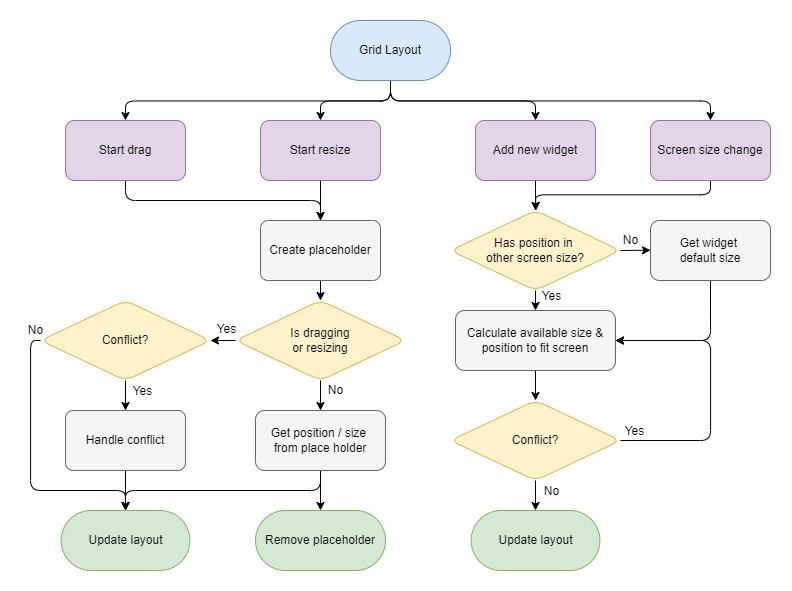

# TabShaker

A Customized Chrome New Tab using **TypeScript & React**.

**Chrome Extension**: [Download](https://chrome.google.com/webstore/detail/tabshaker/eigbinbgomoampdljpjabchdempfileg)

**Video Demo in Chinese** : [YouTube](https://youtu.be/N7jJCULq2Is)

## Table of Contents

- [TabShaker](#tabshaker)
  - [Table of Contents](#table-of-contents)
  - [About TabShaker](#about-tabshaker)
  - [Grid Layout](#grid-layout)
      - [Event Flow](#event-flow)
      - [Different Layout in different screen sizes](#different-layout-in-different-screen-sizes)
      - [Independent Layout in different screen sizes](#independent-layout-in-different-screen-sizes)
  - [Widgets](#widgets)
      - [Calendar](#calendar)
      - [Note](#note)
      - [Weather](#weather)
      - [English Card](#english-card)
      - [To-do List](#to-do-list)
      - [News](#news)
      - [Clock](#clock)
  - [Other Features](#other-features)
      - [Add New Widget](#add-new-widget)
      - [Short Cut](#short-cut)
      - [Background View](#background-view)
      - [Google Tools Menu](#google-tools-menu)
  - [APIs](#apis)
  - [License](#license)

## About TabShaker

- In-house user-friendly layout design for adjusting widget placement and smooth position conflict handling.
- User can move / resize widgets with independent placement in different screen sizes.
- Several productivity widgets with responsive visual styling, including:
  - **Calendar:** Connect with Google Calendar through Google OAuth 2 (Verified)
  - **Note:** Markdown editor
  - **Weather:** Geo-location & OpenSourceMap APIs
  - **English Card:** Crawled 16,272 words (Python)
  - **Clock:** SVG text
  - **News:** News API
  - **To-do List:** CRUD to-dos

## Grid Layout

#### Event Flow

#### Different Layout in different screen sizes

#### Independent Layout in different screen sizes

## Widgets

#### Calendar

- Connect to user's Google Calendar
- Handle user log-in through Google OAuth 2
- Handle Google Calendar's data to be shown in FullCalendar
- Two display modes
  - Monthly calendar in large size
  - Weekly list calendar in small size

#### Note

- Markdown editor with Lexical
- Convert markdown data to json to be stored

#### Weather

- Show weather forecast
- Editable city name with instant search
- 6 display modes
- Get user's current latitude & longitude through Geo-location API
- Get user's current located city through OpenSourceMap API
- Get city's weather through CWB API

#### English Card

- Collect multi-English-level words using Python
- Random show 5 words everyday
- Play sound of English words's pronunciation
- Show definition, example & API of English Word
- Switch & refresh words
- Multi-level selections
- Get data from Firebase Firestore

#### To-do List

- CRUD To-dos
- Title editable
- To-do re-editable
- Filter all / completed / active to-dos

#### News

- Show top headlines in multiply countries (selectable)
- Get news data through News API

#### Clock

- flexible font size based on container size
- SVG text

## Other Features

#### Add New Widget

- Calculate available position for adding new widget

#### Short Cut

- Link to specified url with handling string (with or without https:// )
- Show specified url's favicon
- Debounce to show delete icon

#### Background View

- Switch photos
- Play / Pause playing
- Lazy loading
- Image loading performance fine tune
- Get photos through unsplash APIs

#### Google Tools Menu

- Link to useful Google tools

## APIs

- Google OAuth 2
- Google Calendar
- Google Favicon
- Chrome API
- Firebase Firestore
- News API
- Unsplash
- Geo-location
- OpenSourceMap
- CWB (Central Weather Bureau)

## License

MIT license
